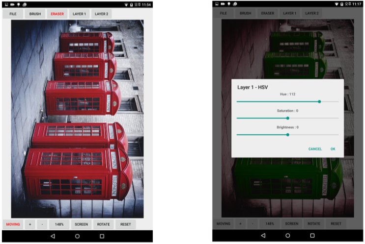
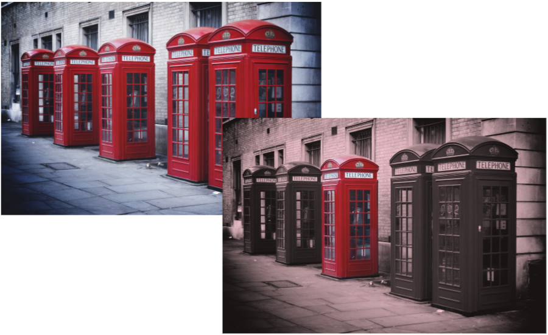
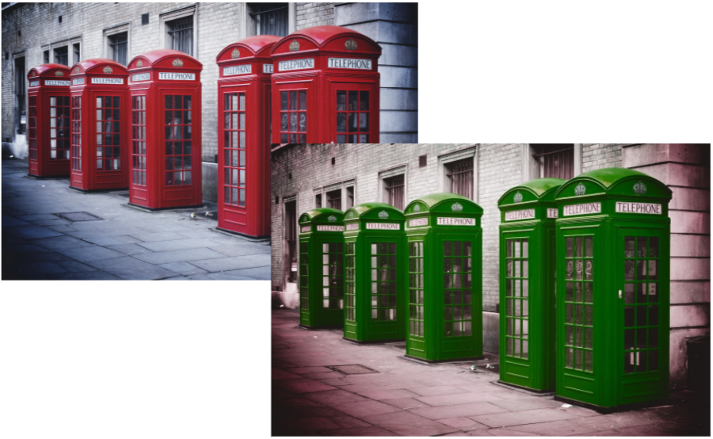
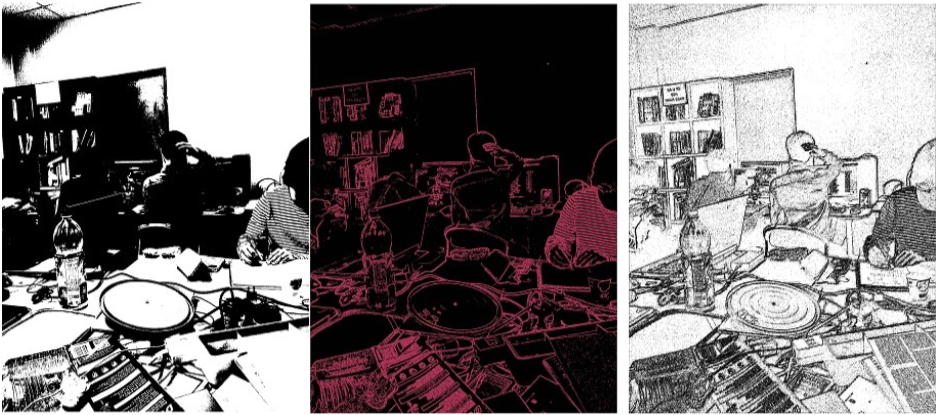
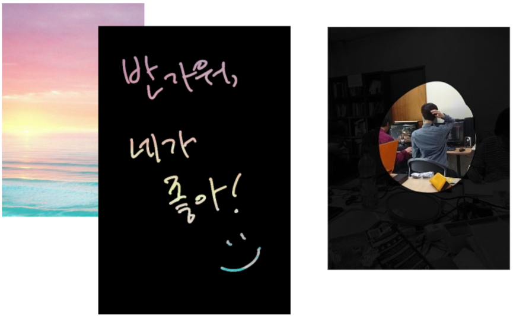

# [개인] 이미지 리터칭 안드로이드 앱 제작 프로젝트
**This project has been deprecated. This may not be executable any more.**

**진행 기간**: 2015. 03. ~ 2015. 06.

**사용 언어/기술**: Java (안드로이드 타겟), AndroidImageFilter

## 소개

지원받았던 안드로이드 태블릿 (Nvidia Shield)과 펜을 사용하다가, 펜을 활용하는 앱 제작을 해보려고, 앱 기획 및 개발함.

이미지의 전체 영역 혹은 유저가 캔버스 위에 칠한 영역을 리터칭 할 수 있음.

이미지에 AndroidImageFilter가 제공하는 18가지 필터를 적용할 수도 있고, HSV나 사이즈 변경 등이 가능.

## 스크린샷

앱 사용 예시 화면

응용 예제: 유저가 칠한 영역 밖을 Sepia톤으로 바꿈. 전체적으로 감성을 주고, 일부를 돋보이게 하는 연출.

응용 예제: 유저가 칠한 영역의 HSV를 변경함. 그 외의 영역도 다른 HSV로 변경.

응용 예제: 여러 필터를 적용한 예시

응용 예제: 유저가 칠한 영역으로 이미지를 마스킹함. 감성적인 손글씨 이미지를 만들거나, 자연스러운 포커싱 연출 가능.

